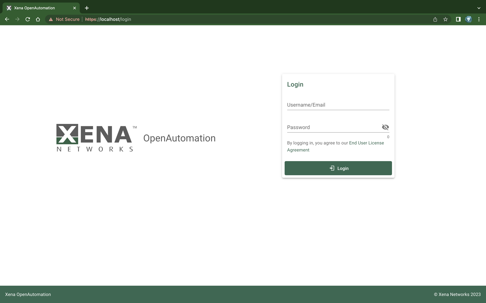

Installation Steps
===================

1. Unzip 
--------------------

Unzip the archive to a directory of your choice.

2. Launch Installation Script
------------------------------

``cd`` into the newly extracted folder and launch the installation script.

.. code-block:: shell

    $ cd xoa-app.1.0.0
    [xoa-app.1.0.0]$ python install.py

3. Set Installation Path
------------------------------

.. code-block:: shell
    
    Please input installation path (Default: './xoa') [Yor input]:> 

Press :kbd:`ENTER` to use the default path and continue.

4. Select Mode of Node
------------------------------

Select the mode of the XOA Node to install.

.. code-block:: shell
    
    Select app mode, (Default: 1  <Duo mode>):
            [1] Modes: Duo - Both Manager and Worker will be installed on the same host
            [2] Modes: Manager - Only manager will be installed.
            [3] Modes: Worker - Only worker will be installed.
    [Yor input]:> 1

Select Mode ``1`` and :kbd:`ENTER` to continue.

.. seealso::

    Read more about the modes of XOA nodes in :doc:`node`

5. Host name
------------------------------

.. code-block:: shell
    
    Host [Yor input]:> localhost

Type ``localhost`` or ``0.0.0.0``, and and :kbd:`ENTER` to continue.

6. Database User
------------------------------

.. code-block:: shell
    
    Database User [Yor input]:> xoa

Type database username of your choice, e.g. ``xoa``, and and :kbd:`ENTER` to continue.

7. Database Password
------------------------------

.. code-block:: shell

    Database Password (pDZ_SgEquHBQytY**Uj2) [Yor input]:> 12345678

Type database password if you want to use your own password, else the generated password (in the brackets) will be used. :kbd:`ENTER` to continue.

8. Database Name
------------------------------

.. code-block:: shell
    
    Data Base Name [Yor input]:> xoa_db

Type database name of your choice, and :kbd:`ENTER` to continue.

9. Start Docker
------------------------------

.. code-block:: shell
    
    xoa-app.1.0.0 > cd xoa
    xoa > docker-compose up

10. Access
------------------------------

Open a web browser and go to ``https://localhost`` to start using XOA Test Suites Application. You will see the login page below.

.. note::

    You can also use another computer to access ``https://<host_ip_address>``.

