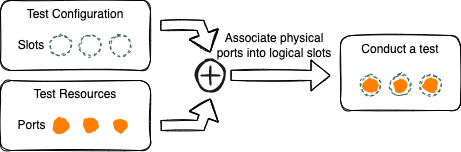

Basic Use Flows
=====================================

If you're familiar with Xena's Windows-based test suite applications `Valkyrie2544 <https://xenanetworks.com/product/valkyrie2544/>`_, `Valkyrie2889 <https://xenanetworks.com/product/valkyrie2889/>`_, `Valkyrie3918 <https://xenanetworks.com/product/valkyrie3918/>`_, and `Valkyrie1564 <https://xenanetworks.com/product/valkyrie1564/>`_, you'll find it easy to navigate the XOA Application. Many of the configuration parameters, naming conventions, and principles are similar.

However, it's important to note that XOA Application, as a framework that accommodates various test suites, brings several innovative features to the table. These differences from the traditional Windows-based test suite applications are detailed in the following section.

From Test Configuration to Test Report
---------------------------------------

.. _basic-flow:

    From Test Configuration to Test Report

A basic workflow, starting from creating a test configuration to downloading a test report, is illustrated in :numref:`basic-flow`. To carry out a test, it's necessary to link a test configuration with the test resources. The test data, produced during the test execution and paired with a report configuration, will yield a test report.

Separation Between Logical and Physical
----------------------------------------

    Separation Between Test Configuration and Test Resources

In the test suite applications that run on Windows, the test configurations are integrated with the physical test resources and the setup of the testbed. If you decide to share these configurations that align with your test environment with others, there might be issues. The person receiving these configurations may have a different testbed setup, for instance, a different chassis IP. Consequently, without altering the json data of the file, they would be unable to open your test configuration. This frequent need for alterations can often cause misconfigurations and complicate the sharing of test configurations.

Within the XOA Application, test configurations are separated from physical test resources. When formulating a test configuration, you produce slots within the topology that serve as placeholders for physical test ports. All parameters within the test configuration are fully autonomous from the physical ports. When the time comes to perform a test, you select a test configuration and link it to the physical test ports to initiate a test execution. This separation between logical and physical configurations provides the flexibility for others to conveniently utilize your test configuration in their respective test environments.

Concurrent Test Executions
----------------------------------------

Thanks to the separation between test configurations and test resources, it's effortless to conduct tests concurrently on various test ports using the same test configuration.

    Concurrent Test Executions

Separation Between Results and Reporting
-----------------------------------------

.. figure:: ../_static/understanding/report_config_test_data.png
    :width: 40%
    :alt: Separation Between Results and Reporting

    Separation Between Results and Reporting

Just as the XOA Application distinguishes between test configurations and test resources, it also separates test data from report configuration formats. Every time a test is conducted, the application stores the resultant data in a database that is part of the XOA Manager node. If you want to download a test report, you need to select the desired report configuration. This separation not only facilitates the creation of reports in various formats from the same test results, but it also makes it possible to share the test data with others.

Locked and Draft Test Configurations
-------------------------------------

    Locked and Draft Test Configurations
    
A test configuration has two states: ``locked`` and ``draft``.

A locked test configuration cannot be modified, but it allows you to conduct a test with it. A draft test configuration, on the contrary, allows you to resume the editing but you won't be able to conduct any test with. This is to prevent the scenario that a modified test configuration doesn't match its previously generated test data and to protect the consistency between test data and test configurations.

