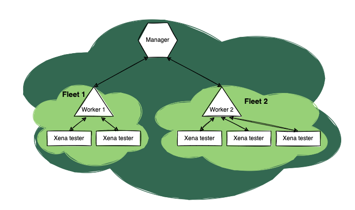

Cluster, Fleet, Node
=====================

XOA Cluster
------------
A ``Cluster`` is a collaborative set of nodes that establish a XOA deployment, with a minimum of one XOA Node included.

* For centralized persistent data storage reasons, it's strongly advised to maintain just one XOA Cluster per organization.
* These clusters are designed to facilitate communication between Workers and the Manager across networks.

XOA Fleet
------------

A ``Fleet`` is the management domain of a XOA Worker that manages a group of Xena physical and virtual testers. A Fleet consists of only one XOA Worker and at least one Xena tester (hardware or virtual).

* Fleets are designed to be run in a local network with low-latency links between the Worker and Xena testers.
* Large testbed, such as inter-network, may require multiple Fleets to cover Xena testers at different remote locations (available in a future release).

XOA Node
---------

A XOA Node is a docker container hosting the entire service stack. A XOA Node can be configured into three different working modes, Manager, Worker, or Duo.

Manager Node
^^^^^^^^^^^^^

Manager nodes are XOA Nodes configured into Manager mode. A Manager node is the central point of a XOA Cluster for operations, administration, and management. An organization should only have one active Manager due to its centralized persistent data storage. However, a Cluster with multiple Managers adds high availability and horizontal scaling (available in a future release).

Manager nodes have a variety of unique responsibilities:

* System frontend with modernized web user interface
* Persistent data storage
* Report generator
* User management
* Inter-fleet communication relay

Worker Node
^^^^^^^^^^^^^

Worker nodes are XOA Nodes configured into Worker mode. A Worker node is the central point of a Fleet. Worker nodes have a variety of unique responsibilities:

* REST API for integration into a third-party test automation framework
* Manage Xena physical and virtual testers
* Test suites repository, test execution, forwarding statistics to either Manager or customer REST endpoints
* Inter-fleet communication gateway

Duo Node
^^^^^^^^^^^^^

Duo nodes are XOA Nodes configured into Duo mode, which provides functionalities of a Manager and a Worker. This combined mode simplifies node deployment when the testbed is relative small-scale.

