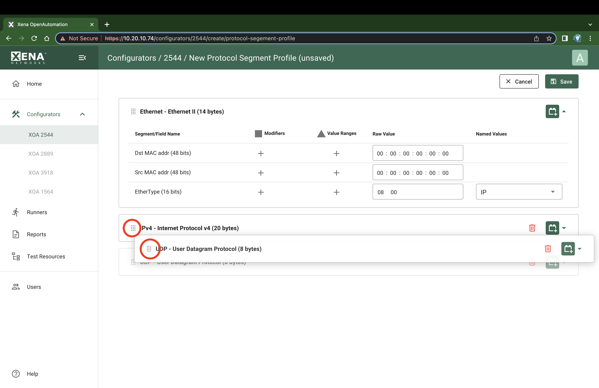

Protocol Segment Profile Editor
===============================

Add Segment Headers
--------------------------------

To add a new segment header press the :guilabel:`Add protocol segment` button in the upper right corner as shown in :numref:`psp_editor_add_1`. You will then be presented with a dialog listing all built-in segment types from which you can select one or more types to be included, as shown in :numref:`psp_editor_add_2`. 

.. note::

    The new segment header will be added below the one where you click the :guilabel:`Add protocol segment` button.

If you want to use a segment not currently supported by the XOA2544 you can add a raw segment and specify the length in bytes, as shown in as shown in :numref:`psp_editor_add_3`. You can then afterwards edit the values in the resulting segment using the hex editor at the bottom.

.. _psp_editor_add_1:

    XOA2544 Protocol Segment Profiles - Add predefined segment (1)

.. _psp_editor_add_2:

    XOA2544 Protocol Segment Profiles - Add predefined segment (2)

.. _psp_editor_add_3:

    XOA2544 Protocol Segment Profiles - Add raw segment

Remove Segment Headers
--------------------------------

You can remove segments clicking :guilabel:`Remove` button, as shown in :numref:`psp_editor_remove`.

.. _psp_editor_remove:

.. figure:: ../../../../_static/xoa2544/reference/configurators/psp_editor_remove.png
    :width: 100%
    :alt: XOA2544 Protocol Segment Profiles - Remove segment

    XOA2544 Protocol Segment Profiles - Remove segment

Reorder Segment Headers
--------------------------------

You can change the order in which the segment headers appear by using the Move Up/Down, as shown in :numref:`psp_editor_move`.

.. note::

    The first segment header cannot be moved, and it is not allow to move other segment header above the first one. This is because the frame must be an Ethernet frame.

.. _psp_editor_move:

    XOA2544 Protocol Segment Profiles - Move segment

.. note::
    
    The XOA2544 will automatically adjust the value of any standard ``next-protocol`` field (such as the ``EtherType`` field) in the segment headers when other segments are added, removed or moved.

Editing Field Values
------------------------

You can thus expand each segment branch to view and optionally modify the various field values. Certain fields, such as the ``EtherType``, are associated with a set of commonly used named values. These can be selected in the :guilabel:`Named Values` column. You are however free to enter any value you want in the :guilabel:`Raw Value` column.

MAC and IP Addresses
------------------------

The address fields in the Ethernet and IP section headers will usually be overridden by the XOA2544 when the test streams are created:

* The Source MAC (SMAC) address field in the first Ethernet segment will be set to the MAC address of the source port.
* The Destination MAC (DMAC) address field in the first Ethernet segment will be set to the MAC address of the destination port. If an IP segment has been defined and a gateway IP address is defined for a source port, the XOA2544 will however attempt to resolve the MAC address of the gateway using ARP or NDP and wil then use this MAC address as the DMAC.
* The IP Source/Destination Address fields in the IP segment header will be set to the values configured on the ports, as explained in the Selected Ports panel section above.

.. important::
    
    This replacement will however only be performed if you leave the fields at their default (all-zeros) value. If you specify anything else this value will be used instead.
