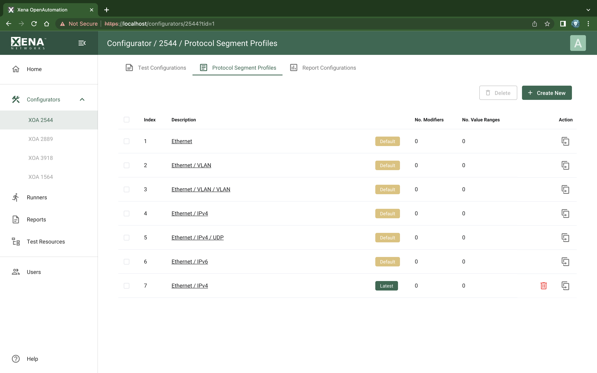

Protocol Segment Profile List
===============================

:menuselection:`Configurators --> XOA 2544 --> Protocol Segment Profiles` page lists your XOA2544 protocol segment profiles.

.. _ref-config-2544-psp:

    XOA2544 Protocol Segment Profiles

Available Protocol Segment Profile List
----------------------------------------

The list view show all your XOA2544 protocol segment profiles.

:guilabel:`No. Modifiers` shows the number of modifiers used by the protocol segment profile.

:guilabel:`No. Value Ranges` shows the number of value ranges used by the protocol segment profile.

On this page, you can view 2544 protocol segment profiles. You can either use a single protocol segment profile for all slots or use a separate profile for each slot. In this way you can define an asymmetric traffic setup.

Managing Protocol Segment Profiles
-----------------------------------

You can create and delete profiles to match the need of the your test scenario. To create a new profile press the :guilabel:`Create New` button. To delete a profile, click the :guilabel:`Delete` icon. To delete multiple profiles, use the checkboxes to select them and click the :guilabel:`Delete` button.

.. note::

    XOA2544 comes with six default protocol segment profiles labelled with :guilabel:`Default`. The default protocol segment profiles cannot be deleted but you can create new ones from them.
