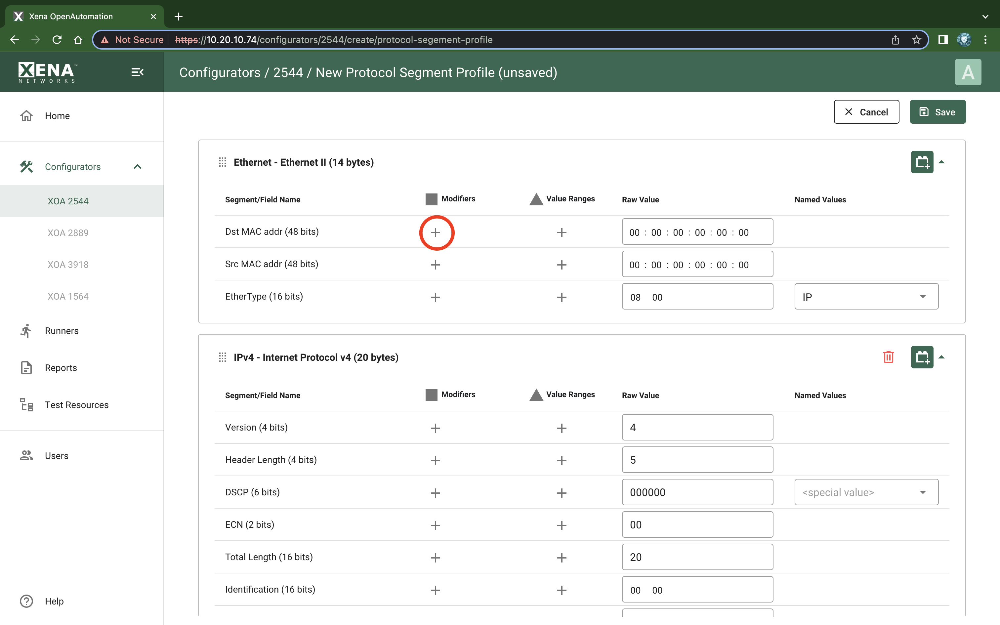
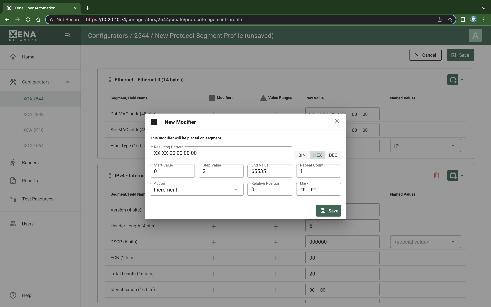
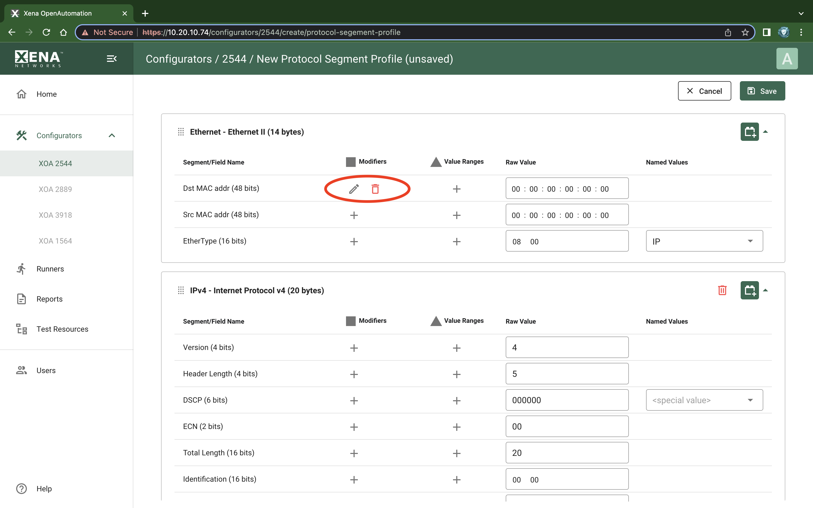

Modifiers
===============================

It is possible to attach a modifier definition to one or more fields. A modifier will exercise the field with various values during the test and can be used to emulate a certain dynamic behavior.

Modifiers are often used to exercise either the VLAN PCP or the IP DHCP fields. Alternatively one could apply modifiers to address fields like the DMAC field or the source or destination IP address fields.

Add Modifier
------------------

To add a modifier to a field simply select the field and press the :guilabel:`Add Modifier` button on the field row, as shown in :numref:`psp_modifier_add_1`. A :guilabel:`New Modifier` dialog will now be shown as shown in :numref:`psp_modifier_add_2`. 

Fill in the various field values and press the :guilabel:`Save` button to add the modifier to the field. Once a modifier has been added to a field, you will see the :guilabel:`Edit` and :guilabel:`Delete` button as shown in :numref:`psp_modifier_add_3`.

.. _psp_modifier_add_1:

    XOA2544 Protocol Segment Profiles - Add modifier (1)

.. _psp_modifier_add_2:

    XOA2544 Protocol Segment Profiles - Add modifier (2)

.. _psp_modifier_add_3:

    XOA2544 Protocol Segment Profiles - Add modifier (3)

Editing a Modifier
-------------------

To edit an existing modifier, click the :guilabel:`Edit` button next to the modifier. You will see the same dialog as was used to create the modifier.

Removing a Modifier
-------------------
To remove an existing modifier, click the :guilabel:`Delete` button next to the modifier. 

.. important::

    **Limitations**
    There is a limitation on the maximum number of modifiers that can be defined for each test stream. The limitation is specific for the test module type, to which the port belongs.

