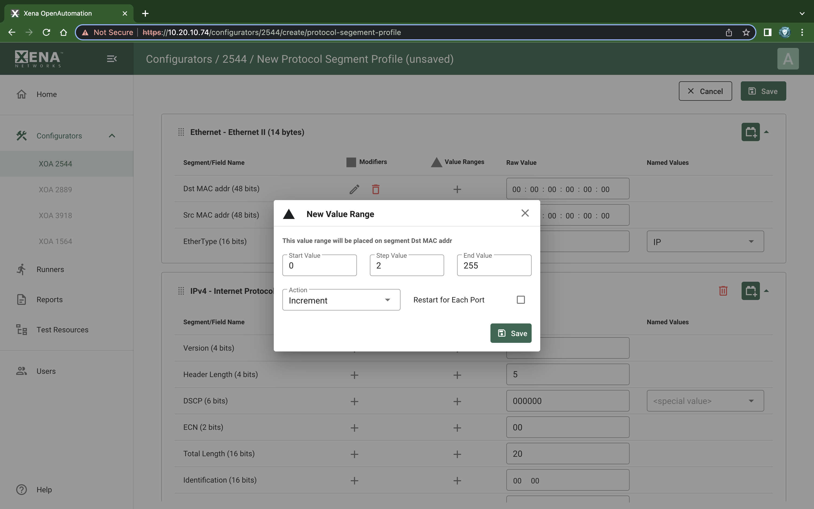

Value Ranges
===============================

A Value Range is intended to exercise one or more fields in a XOA2544 protocol segment profiles with varying values. It is similar to the modifier explained in :doc:`modifier`, with the following differences:

* A Modifier is handled by hardware and **varies a field value between packets** on the same stream.

* A Value Range is handled by software and **varies a field value between different streams**. All packets on the same stream have the same value.

* A Value Range is defined on a field in a protocol segment profile, just like a modifier. It will then be used for all streams created on a port which is assigned this profile.

* Value ranges can be used for both normal single-stream and advanced multi-stream scenarios. For normal scenarios it is most applicable for mesh configurations where multiple streams will be created on each port.

.. note::
    
    There is no limit to the number of values ranges added to a configuration. It is also possible to add both a modifier and a value range to a field. Whether that would yield usable results is unclear but it might be useful for larger fields.

.. _psp_value_range:

    XOA2544 Protocol Segment Profiles - Add value range