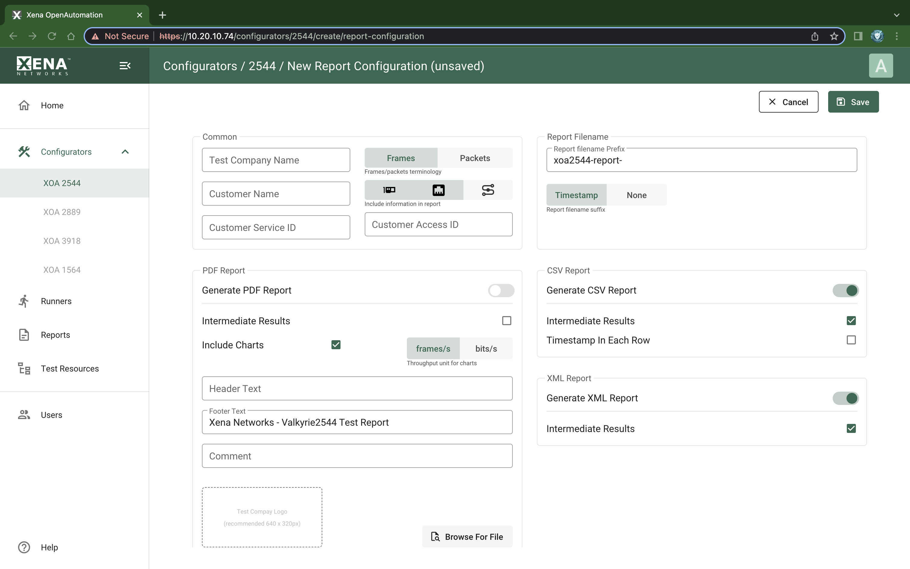

Report Configuration Editor
============================

    XOA2544 Report Configuration Editor

Common
-------
This section contains a number of options that can help identify the test context.

.. list-table:: Common Section
    :widths: 15 85
    :header-rows: 1
    :stub-columns: 1

    *   - Parameter
        - Explanation
    *   - Customer Name
        - The name of the customer for which the test is performed.
    *   - Customer Service ID
        - Allow you to provide details about the network circuits you are testing.
    *   - Customer Access ID
        - Allow you to provide details about the network circuits you are testing.
    *   - Packets/Frames Terminology
        - This property allows you to determine whether the units of data are referred to as “packets” or “frames”.
    *   - Include Module Information in Report
        - If checked the report will also contain information for each module.
    *   - Include Detailed Port Information in Report
        - If checked the report will also contain detailed results for each port. If unchecked only the totals will be reported.
    *   - Include Stream Information in Report
        - If checked the per-stream information will also be included in the reports.

Report Filename
----------------
This section contains options that affect the way report filename is generated.

.. list-table:: Report Filename
    :widths: 15 85
    :header-rows: 1
    :stub-columns: 1
    
    *   - Parameter
        - Explanation
    *   - Report Filename Prefix
        - Specifies the prefix for the report filename.
    *   - Report Filename Suffix
        - Specifies the suffix for the report filename. If :guilabel:`Timestamp` is selected, <YYYYMMDD-HHMMSS> is appended to the filename suffix.
    

PDF Report
-----------
This section contains options that affect the way PDF report is generated.

.. list-table:: PDF Report
    :widths: 15 85
    :header-rows: 1
    :stub-columns: 1

    *   - Parameter
        - Explanation
    *   - Generate PDF Report
        - Specifies if PDF report should be generated from the test result.
    *   - Intermediate Results
        - Specifies if results from binary searching steps should be included.
    *   - Include Charts
        - If checked the report will include bar charts showing the test results.
    *   - Throughput Unit for Charts:
        - Use this to select whether to use frames/second ot bits/second as the unit for throughput charts.
    *   - Header text
        - To customize PDF report header text.
    *   - Footer text
        - To customize PDF report footer text.
    *   - Comments
        - Allows you to provide any multi-line comments for the test configuration.
    *   - Test Company Logo
        - To customize the logo

CSV Report
-----------
This section contains options that affect the way CSV report is generated.

.. list-table:: CSV Report
    :widths: 15 85
    :header-rows: 1
    :stub-columns: 1

    *   - Parameter
        - Explanation
    *   - Generate CSV Report
        - Specifies if CSV report should be generated from the test result.
    *   - Intermediate Results
        - Specifies if results from binary searching steps should be included.
    *   - Timestamp In Each row
        - If checked, timestamps will be appended to each row.

XML Report
-----------
This section contains options that affect the way XML report is generated.

.. list-table:: XML Report
    :widths: 15 85
    :header-rows: 1
    :stub-columns: 1

    *   - Parameter
        - Explanation
    *   - Generate XML Report
        - Specifies if XML report should be generated from the test result.
    *   - Intermediate Results
        - Specifies if results from binary searching steps should be included.

