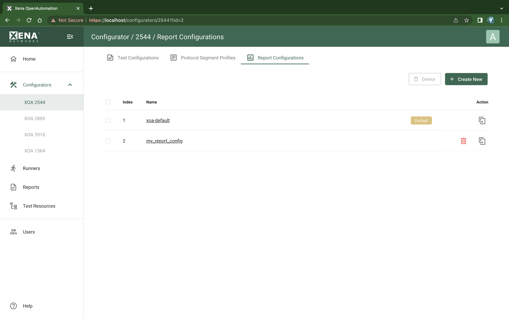

Report Configuration List
==========================

:menuselection:`Configurators --> XOA 2544 --> Report Configurations` page lists your XOA2544 report configurations.

.. _ref-config-2544-rc:

    XOA2544 Report Configurations

Available Report Configuration List
-----------------------------------

The list view show all your XOA2544 report configurations.

On this page, you can view 2544 report configurations. They will pop up in the drop-down selection box when generating a test report from test result data.

Managing Report Configurations
-----------------------------------

To create a new report configuration, press the :guilabel:`Create New` button. To delete a report configuration, click the :guilabel:`Delete` icon. To delete multiple profiles, use the checkboxes to select them and click the :guilabel:`Delete` button.

.. note::

    XOA2544 comes with a default report configuration labelled with :guilabel:`Default`. The default report configuration cannot be deleted but you can create new one from it.
