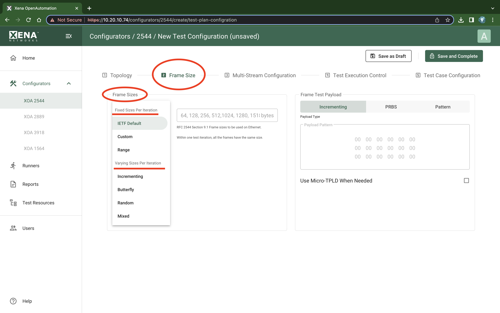
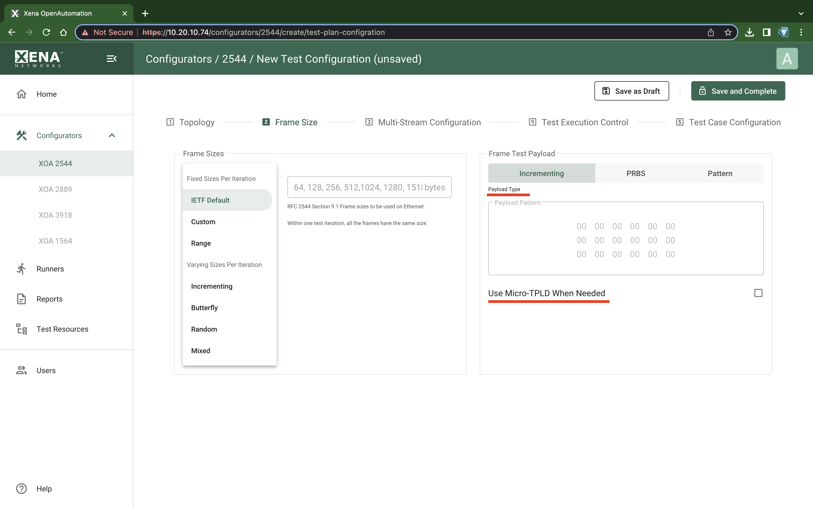

Frame Size
===============

Frame Sizes
------------------------------

    XOA 2544 Test Configuration Frame Sizes

This section allow you to specify the frame sizes to be used by the various tests. The available frame size options are divided into two groups, the :guilabel:`Fixed Sizes Per Iteration` and the :guilabel:`Varying Sizes Per Iteration`.

As the name indicates the :guilabel:`Fixed Sizes Per Iteration` group uses a single frame size per iteration. It is possible to specify multiple frame sizes which will cause the test to be repeated for each frame size.

.. list-table:: Fixed Frame Sizes
    :widths: 15 85
    :stub-columns: 1

    *   - IETF Default
        - The default setting is to use the IEEE standard frame sizes : 64, 128, 256, 512, 1024, 1280 and 1518 bytes. 
    *   - Custom Sizes
        - Let you specify a comma-separated list of values.  This is e.g. useful if you only want to test using one or two packet sizes
    *   - Range
        - Let you specify a range of packet sizes and the steps.

The :guilabel:`Varying Sizes Per Iteration` group will use many frame sizes for each iteration. This is controlled by the hardware.

.. list-table:: Varying Frame Sizes
    :widths: 15 85
    :stub-columns: 1

    *   - Incrementing
        - Let you specify a ``Min`` and a ``Max`` size. The size of each frame: ``Min, Min+1, Min+2,..., Max``.
    *   - Butterfly
        - Let you specify a ``Min`` and a ``Max`` size. The size of each frame: ``Min, Max, Min+1, Max-1, Min+2, Max-2, …``.
    *   - Random
        - Let you specify a ``Min`` and a ``Max`` size. The size of each frame will vary between ``Min`` and ``Max`` randomly.

.. note::
    
    When calculating bit rates, the average frame size will be used.

Frame Test Payload
------------------------------

    XOA 2544 Test Configuration Frame Test Payload

The normal Xena test payload (:term:`TPLD`) section takes up 20 bytes and is used for various purposes, such as latency measurements, loss and misordering monitoring, payload integrity, etc. Due to this test payload it may be impossible to make room for protocol headers such as IPv4+UDP for smaller frame sizes (e.g. ~64 byte).

By enabling the :guilabel:`Use Micro-TPLD When Needed` if needed option you permit XOA2544 to use the smaller **micro-TPLD** if needed by the current frame size. The consequence of this will be that realtime monitoring of packet loss is no longer possible.

.. note::
    
    Note that XOA2544 will only use the micro-TPLD for a test run if the current frame size requires it. If you for instance use the default IEEE packet size distribution you may encounter that the micro-TPLD is only used for 64 byte packets but not for the other packet sizes.

The :guilabel:`Payload Type` property defines the type of test payload in the frames generated by the slots. If the payload type is set to **Pattern** you can specify the pattern in the :guilabel:`Pattern` field.
