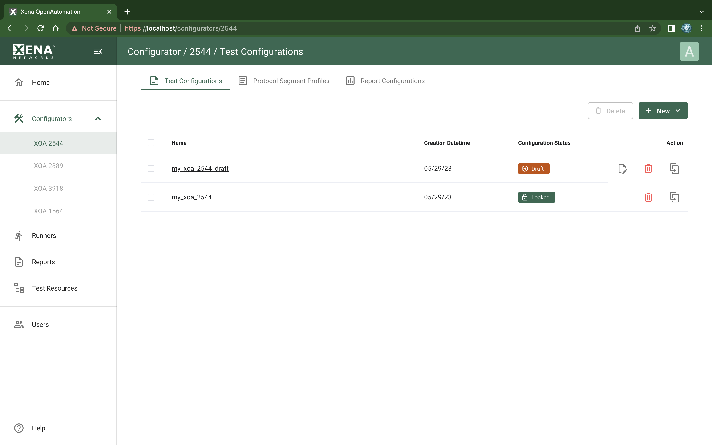

Test Configuration List
=======================

:menuselection:`Configurators --> XOA 2544 --> Test Configurations` page lists your XOA2544 test configurations, both in :guilabel:`Locked` and draft.

.. _ref-config-2544-tc:

    XOA2544 Test Configurations

Available Test Configuration List
----------------------------------

The list view show all your XOA2544 test configurations.

Managing Test Configurations
----------------------------

On this page, you can :guilabel:`New -> Create New` 2544 test configurations or :guilabel:`New -> Import` Valkyrie2544 test configuration into XOA. You can also :guilabel:`Delete`, :guilabel:`Edit`, and :guilabel:`Create From` your existing test configurations.

.. important::

    Only test configurations in ``Draft`` state can be edited. Those in ``Locked`` state cannot be modified. This is to protect the consistency between test results and test configurations.
