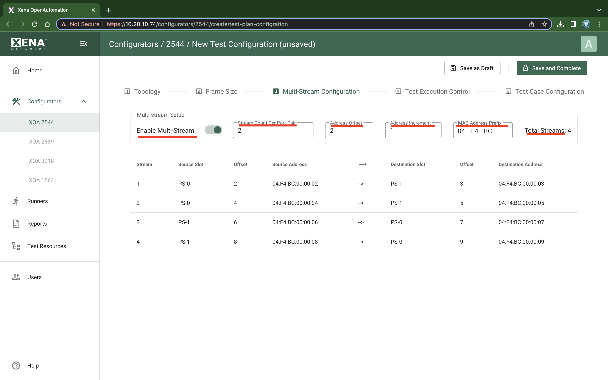

Multi-Stream Configuration
===============================

Overview
--------

The default behavior of XOA2544 is to create a single stream between any two port pairs. Sometimes it is however required to exercise the values of certain address fields in the protocol headers in order to emulate many more clients than the physical port count allows. The multi-stream function can be used to achieve this.

When enabled the multi-stream function will use a number of streams to implement the flow between any two port pairs. The source and destination addresses in the streams will be varied based on certain configuration parameters.

User Interface
--------------

The multi-stream function is enabled and configured in the :guilabel:`Multi-Stream Configuration` tab, as shown below.

    XOA 2544 Test Configuration Multi-Stream

The :guilabel:`Multi-stream Setup` contains the configurable parameters.

Below the setup is a table which show a preview of the resulting streams with the current configuration parameter values. Each row in the table represent a *stream endpoint connection*, which denotes the logical connection between a slot pair. The connection can be unidirectional, in which case it will consist of a single stream, created on the source slot. Or it can be bidirectional, in which case it will consist of two streams, i.e. one stream created on each slot.

The columns in the table show the actual values used for each stream endpoint connection. For an IP configuration the Address columns will show the resulting IP addresses. If the configuration uses pure layer-2 segment profiles (no IP segment) the Address columns will show the resulting MAC addresses.

The total number of streams that will be generated is shown at the top of the table.

Configuration Parameters
-------------------------

The actual configuration parameters is described below.

.. list-table:: Multi-stream configuration parameter description
    :widths: 15 85
    :header-rows: 1
    :stub-columns: 1

    *   - Parameter
        - Explanation
    *   - Enable Multi-Streams
        - Checking this option will enable the multi-stream function for the current XOA2544 configuration.
    *   - Stream Count Per Port-Pair
        - This value sets the stream count per port pair.
    *   - Address Offset
        - The offset from zero (0) used when auto-generating the incrementing addresses. This can be used to avoid using the default gateway for an IP subnet (which usually is xxx.xxx.xxx.1).
    *   - Address Increment
        - The incrementing value used when auto-generating the addresses.
    *   - MAC Address Prefix
        - The MAC address prefix used when auto-generating the MAC addresses. This can be used to avoid collision with the factory-assigned Xena testport MAC addresses.

