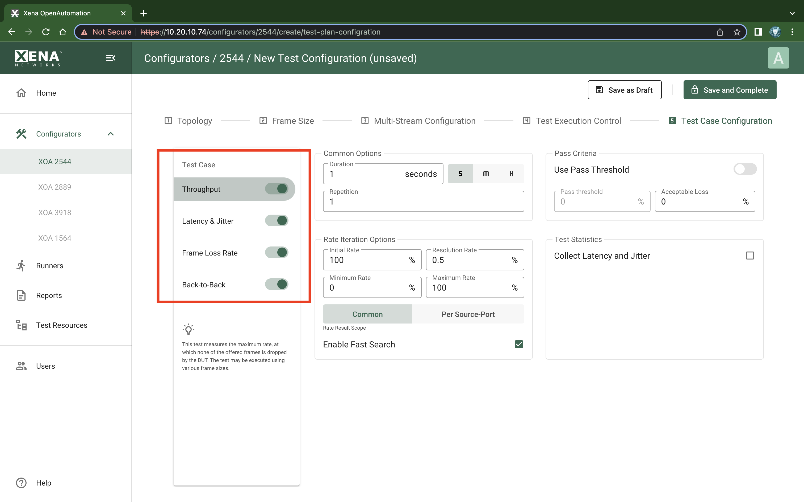
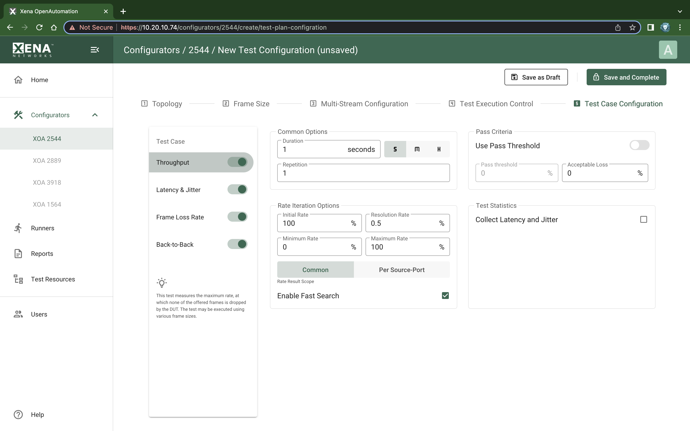
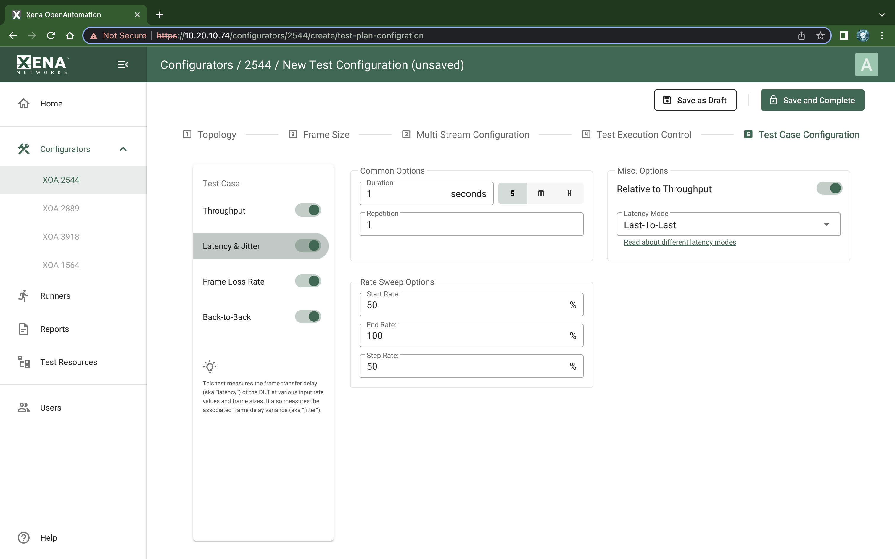
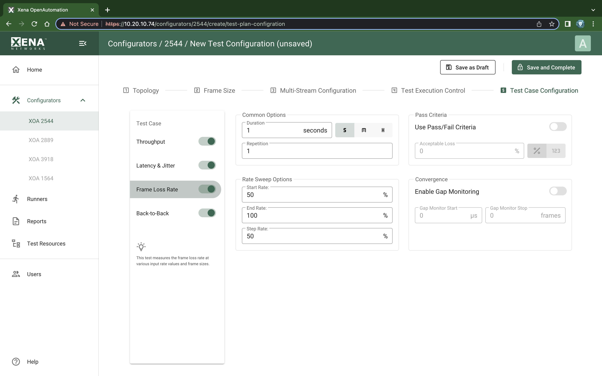
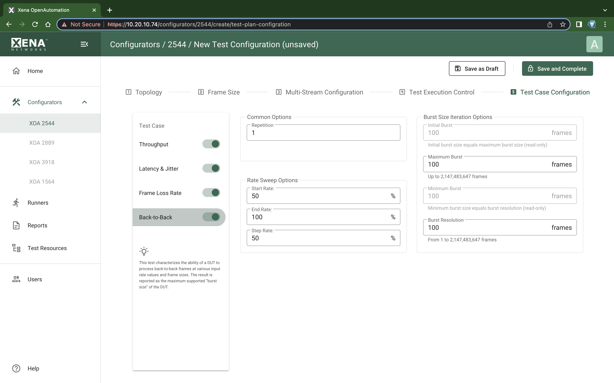

Test Case Configuration
===============================

    XOA 2544 Test Configuration Test Case Configuration

This subpanel defines which RFC 2544 tests would want to perform and also allow you to configure how you want them executed.

To inspect and optionally change the test properties for each test, select the test in the list view. The test properties will now be shown in the panel to the right.

The checkbox to the left of the test name in the tree view determines whether the test is executed or not.

Throughput Test Properties
^^^^^^^^^^^^^^^^^^^^^^^^^^^^

    XOA 2544 Test Configuration Test Case Configuration - Throughput Test Properties

.. list-table:: Throughput Test Properties
    :widths: auto
    :header-rows: 1

    *   - Property
        - Explanation
    *   - Duration
        - The duration of each test trial in seconds.
    *   - Repetitions
        - The number of times to repeat each test trial with the same set of test parameters.
    *   - Initial Rate
        - The starting rate in percent used by the iteration.
    *   - Minimum Rate
        - The minimum rate in percent. If the iteration reaches this value the test will be FAILed.
    *   - Maximum Rate
        - The maximum rate in percent. If the iteration reaches this value the test will PASS.
    *   - Resolution Rate
        - Defines the minimum difference between two rate iterations. If the difference between the next and the last rate iteration is less than this value the test is stopped and the last successful rate is reported.
    *   - Use Pass Threshold
        - Selecting this property will allow you to specify a pass threshold value. If the test result is below this threshold the tested will be FAILed.
    *   - Pass Threshold
        - The pass threshold explained above.
    *   - Acceptable Loss
        - Allow you to specify an acceptable loss in percent of the port rate. Normally this would be zero but for certain network types (such as satellite links) a certain amount of frame loss is acceptable.
    *   - Rate Result Scope
        - Determines the scope of the rate result. 

          * The :guilabel:`Common Result` setting will iterate towards a single throughput rate result for all ports, which will be the lowest common rate found. This is the default setting.

          * If the :guilabel:`Per Source-Port Result` setting is selected the XOA2544 will attempt to iterate a separate rate value for each source port. This will obviously produce a (potentially different) result for each source port.
    *   - Enable Fast Search
        - The default iteration algorithm used is a standard binary search, where the next attempted rate is found as the mean value of the sum of last passed and the last failed rate. If the fast search property is enabled the algorithm will take the measured loss rate into account when iterating down.This may in many cases result in a substantial reduction in the number of trials needed to reach the throughput rate result.

Latency & Jitter Test Properties
^^^^^^^^^^^^^^^^^^^^^^^^^^^^^^^^^

    XOA 2544 Test Configuration Test Case Configuration - Latency & Jitter Test Properties

.. list-table:: Latency and Jitter Test Properties
    :widths: auto
    :header-rows: 1

    *   - Property
        - Explanation
    *   - Start Rate
        - The starting rate in percent of the port rate used by the rate sweep.
    *   - End Rate
        - The ending rate in percent of the port rate used by the rate sweep.
    *   - Step Rate
        - The increments in rate percent for each step in the rate sweep.
    *   - Latency Mode
        - The latency mode used when measuring the latency.
    *   - Relative to Throughput
        - If checked the starting and ending rates will be calculated relative to the result from a preceding throughput test for the same frame size. If the throughput test has not been performed in the same test this setting is ignored.

Frame Loss Rate Test Properties
^^^^^^^^^^^^^^^^^^^^^^^^^^^^^^^^

    XOA 2544 Test Configuration Test Case Configuration - Frame Loss Test Properties

.. list-table:: Frame Loss Test Properties
    :widths: auto
    :header-rows: 1

    *   - Property
        - Explanation
    *   - Start Rate
        - The starting rate in percent of the port rate used by the rate sweep.
    *   - End Rate
        - The ending rate in percent of the port rate used by the rate sweep.
    *   - Step Rate
        - The increments in rate percent for each step in the rate sweep.
    *   - Use Pass/Fail Threshold
        - Selecting this property will allow you to specify an Acceptable Loss value. If the test result is above this value the tested will be FAILed.
    *   - Acceptable Loss
        - Allow you to specify an acceptable loss in percent of the port rate or as a frame count. Normally this would be zero but for certain network types (such as satellite links) a certain amount of frame loss is acceptable.
    *   - Gap Monitor Enable
        - Selecting this property adds Gap Monitoring to the Frame Loss Rate Test. With this convergence time can be measured. The result will appear in the final report.
    *   - Gap Monitor Start
        - Specifies the time period with no packets received that will trigger the gap monitor start.
    *   - Gap Monitor Stop
        - Specifies the number of packets to receive to stop the gap monitor.

.. note::
        
        Gap monitor requires Valkyrie release >= 77.

Back-to-Back Test Properties
^^^^^^^^^^^^^^^^^^^^^^^^^^^^

    XOA 2544 Test Configuration est Case Configuration - Back-to-Back Test Properties

.. list-table:: Back-to-Back Test Properties
    :widths: auto
    :header-rows: 1

    *   - Start Rate
        - The starting rate in percent of the port rate used by the rate sweep.
    *   - End Rate
        - The ending rate in percent of the port rate used by the rate sweep.
    *   - Step Rate
        - The increments in rate percent for each step in the rate sweep.
    *   - Initial Burst
        - Defines the initial burst size. (read-only)
    *   - Minimum Burst
        - Defines the minimum burst size. (read-only)
    *   - Maximum Burst
        - Defines the maximum burst size.
    *   - Burst Resolution
        - Defines the minimum difference between two burst size iterations. If the difference between the next and the last burst size iteration is less than this value the test is stopped and the last successful burst size is reported.
