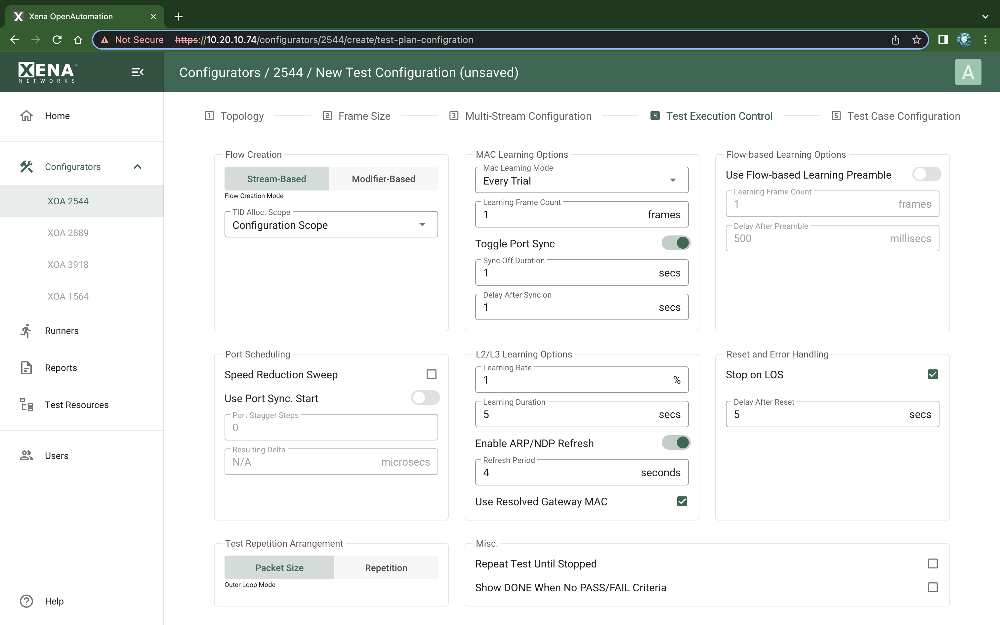
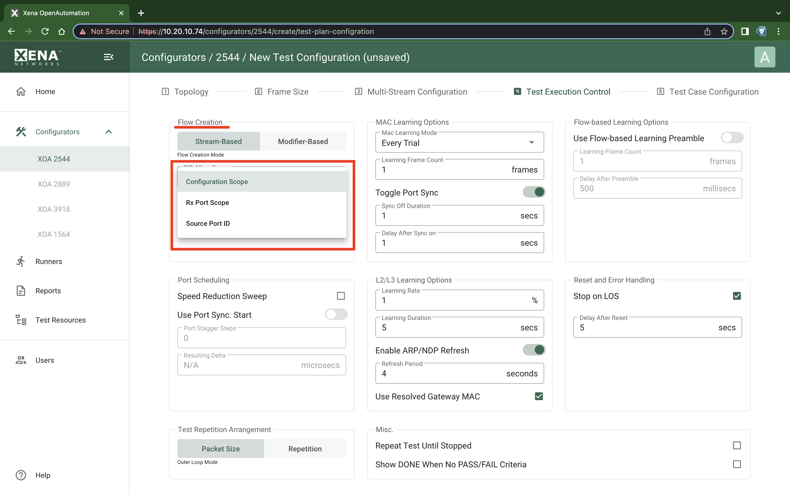
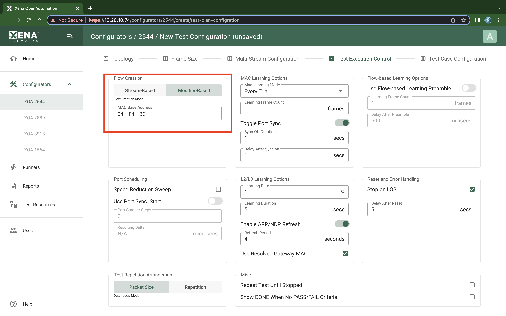
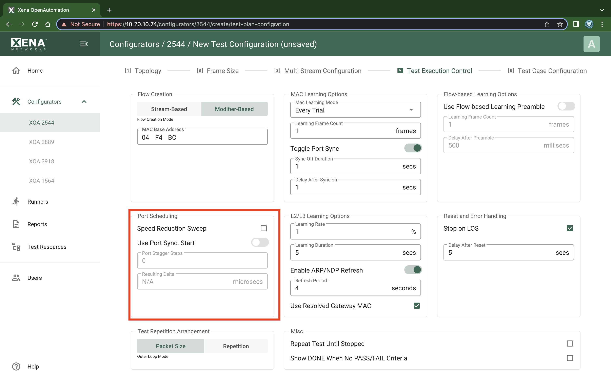
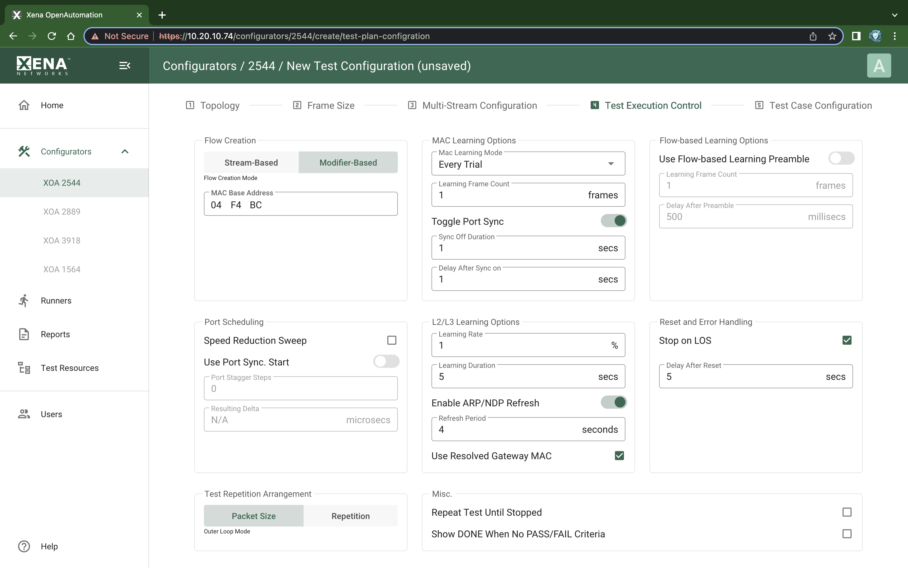
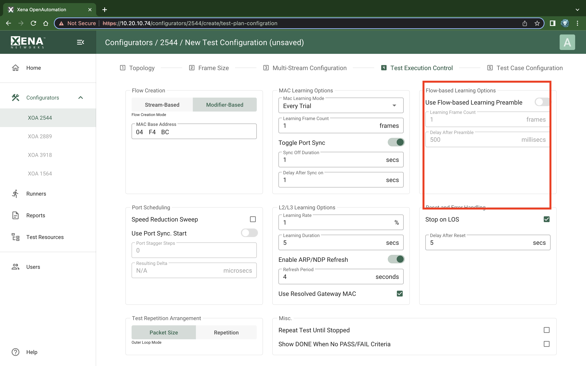
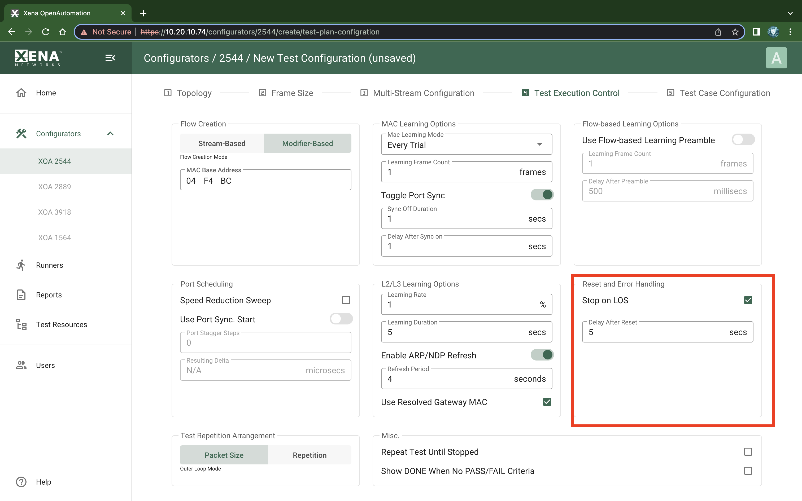

Test Execution Control
===============================

    XOA 2544 Test Configuration Test Execution Control

Flow Creation
-------------

These properties determine how the test flows between ports are created.

Stream-Based Flows
^^^^^^^^^^^^^^^^^^

    XOA 2544 Test Configuration Test Execution Control - Stream-based Flow Creation

The default :guilabel:`Stream-based` setting will use one Xena stream for each flow from one port to another. This enables fine-grained per-port statistics and also allow you to specify field modifiers for various protocol fields. But as the number of streams that can be created on each test port is limited (see below) this will limit the total number of test port in your configuration.

The guilabel:`TID Alloc.Scope` property determines how XOA2544 allocates :term:`TID` values.

    * Configuration Scope: Allocates a unique TID value for each stream created. This option ensures that only packets intended for a given port is taken into account. The downside is that for large configurations you may quickly run out of TID values due to hardware constraints.

    * Rx Port Scope: Allocate TIDs so that all streams received on any given port have a unique TID. TID values are reused between ports. This allow for larger configurations but the test is no longer able to detect if packets are mis-delivered by the DUT.

    * Source Port ID: Allocate TIDs so that all streams from a given port is set equal to the port index in the configuration. This is a slight variation of the previous method.

Modifier-Based Flows
^^^^^^^^^^^^^^^^^^^^
If you encounter the above mentioned limitations in a layer-2 test you can select the Modifier-based option instead. In this mode the XOA2544 will use a single stream for all flows from one port instead of one stream for every flow between two ports.

This will cause the XOA2544 to create the traffic flows using so-called modifiers instead of using streams. This option will however force the XOA2544 to override the native port MAC addresses. The user can specify the 3 upper bytes of the MAC address using the MAC Base Address option but the lower part of the address will be assigned sequentially.

The modifier-based option is not available for layer-3 tests as we cannot emulate multiple MAC addresses the XOA2544 needs to.

    XOA 2544 Test Configuration Test Execution Control - Modifier-based Flow Creation

Port Scheduling
---------------

    XOA 2544 Test Configuration Test Execution Control - Port Scheduling

If enabled the :guilabel:`Speed Reduction Sweep` property will assign a small speed reduction value to each port on a test module, so that each port on the module will get a different value. This property is available for Blocks and Mesh topologies.

If the :guilabel:`Use Port Sync. Start` option is checked the :guilabel:`Start` button will activate a synchronized port start mechanism for the ports - if the chassis firmware version supports this feature.

The :guilabel:`Port Stagger Steps` property delays start of traffic generation on one port relative to pressing Start button. The delay is programmed in steps of 64 microseconds. The Port Stagger function will work between ports on test modules installed in the same chassis. First port will not be delayed. Second port will be delayed with the ``Port Stagger Steps``. Third port will be delayed with the ``Port Stagger Steps x 2``. Fourth port will be delayed with the ``Port Stagger Steps x 3``, etc. Maximum Port Stagger Steps value for a port is 31250. Therefore the programmed ``Port Stagger Steps`` must not exceed ``31250/(number of ports)``. 

.. note::
    
    This requires that :guilabel:`Use Port Sync Start` has been checked.

The :guilabel:`Resulting Delta` is `Port Stagger Steps * 64` microseconds.

MAC Learning Options
--------------------

    XOA 2544 Test Configuration Test Execution Control - MAC Learning

The :guilabel:`MAC Learning Mode` property can be used to instruct the testers to emit initial MAC learning packets in order for any network switches to learn the MAC addresses of the ports and avoid excessive flooding of packets. You can specify if you want MAC learning to be performed either at the start of every iteration (the default), once when the test starts or not at all. You can also specify how many time each learning packet will be repeated every time with the :guilabel:`Learning Frame Count` option.

If the :guilabel:`Toggle Sync State` property is checked the sync state for all selected ports will be toggled off and on at the start of each test trial. This may ensure that the DUT's MAC tables are cleared at the start of each test. The :guilabel:`Sync Off Duration` is the number of seconds to keep the port sync state off.

L2/L3 Learning Options
-----------------------

    XOA 2544 Test Configuration Test Execution Control - L2/L3 Learning

This set of options control how the Xena tester advertises the IP addresses configured for its ports. The tester will use ARP for IPv4 and NDP for IPv6. If the :guilabel:`Enable ARP/NDP Refresh` checkbox is checked the tester will periodically emit ARP requests (for IPv4) or Neighbor Advertisement requests (for IPv6). The period can be set using the :guilabel:`Refresh Period` field. This will prevent the ARP/NDP caches in the attached router from timing out during long test period thus causing a packet loss.

If the test uses multiple ports and/or you have used modifiers to emulate multiple IP address on one port the number of periodic refresh requests may be large. The tester will retransmit all refresh requests within the specified period, but it will not send them all in one batch. The tester will distribute the necessary requests evenly over the specified period. 

When the :guilabel:`Use Resolved Gateway MAC` checkbox is checked XOA2544 will use the ARP-resolved gateway MAC address as destination MAC address for test packets. This is only relevant for IP traffic where the test ports belong to different IP subnets and the traffic needs to go through an IP router.

Flow-Based Learning
--------------------

    XOA 2544 Test Configuration Test Execution Control - Flow-based Learning

This section contains a few properties that are mainly useful when working with flow-based switches.

Some DUT`s have learning curve for new flows to eliminate the initial latency spikes. The :guilabel:`Use Flow-Based Learning Preamble` property will make the XOA2544 emit a brief traffic preamble before starting the actual test. This can be used to ensure that the flow-based switch has learned all necessary addresses. The :guilabel:`Learning Frame Count` controls how many frames are sent in the preamble. The :guilabel:`Delay After Preamble` determines the size of the period between the preamble and the start of the actual test traffic.

Reset and Error Handling
------------------------

    XOA 2544 Test Configuration Test Execution Control - Reset and Error Handling
    
If :guilabel:`Stop on LOS` is enabled, XOA2544 will abort the test if a port loses the sync state during test.

When a XOA2544 test is started, the selected ports will be reset to ensure a known starting point for the test. The :guilabel:`Delay After Reset` parameter defines how long time XOA2544 will wait after the reset before it continues with the test.
