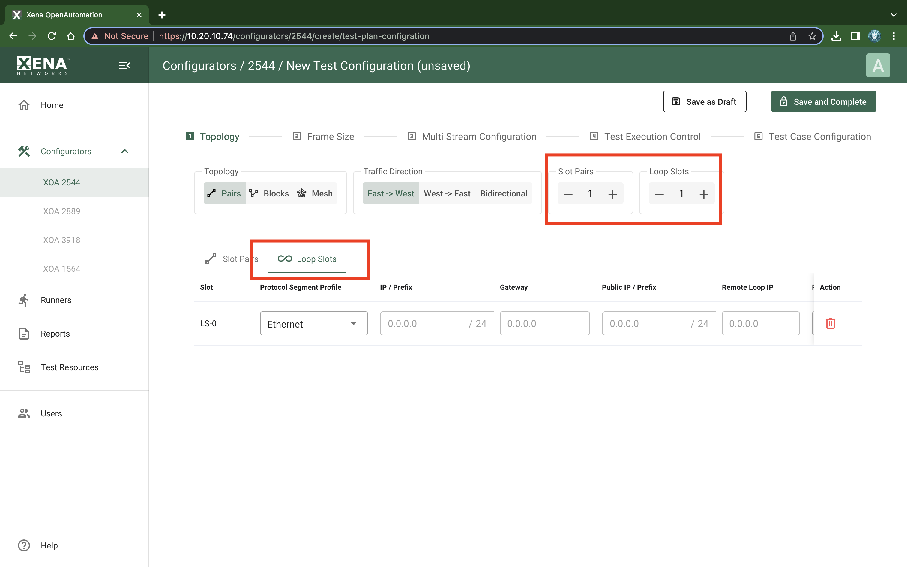
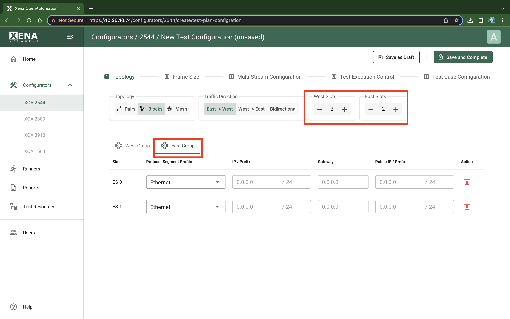

Topology
============

Topology and Traffic Direction
------------------------------

These properties define the topology and direction of the test traffic:

* **Pairs**: Each slot is placed in either the East or the West block. Then the ports are paired together two and two. Traffic is only flowing between paired slots. The Direction option determines which ports will be transmitting.

* **Blocks**: Each slot is placed in either the East or the West block. Every port in the transmitting block sends traffic to every port in the other block. The Direction option determines if only one block or both will be transmitting.

* **Mesh**: All slots send traffic to all other slots. The Direction option is ignored as Mesh traffic is always bidirectional.

    XOA 2544 Test Configuration Topology and Traffic Direction

Slot Configuration
-------------------
For Pair topology, Slot Pairs stepper creates paired slots. Loop Slots stepper creates looped slots.

    XOA 2544 Test Configuration Slot Pairs

    XOA 2544 Test Configuration Loop Slots

For Blocks topology, West Slots stepper creates slots in the west group, and East Slots stepper creates slots in the east group.

    XOA 2544 Test Configuration West Slots

    XOA 2544 Test Configuration East Slots

For Mesh topology, Slot Count stepper creates slots.

    XOA 2544 Test Configuration Topology Slots

Slot Pair Address Table
-----------------------

    XOA 2544 Test Configuration Slot Pair Address Table 

.. list-table:: Slot Pair Address
    :widths: auto
    :header-rows: 1

    *   - Parameter
        - Explanation
    *   - Protocol Segment Profile
        - The protocol segment profile to use for this slot. Profiles can be created, edited and deleted in the separate :guilabel: `Protocol Segment Profiles` tab.
    *   - IP Address/Prefix
        - The IP address that you want to use for the slot, and the decimal network prefix for the IP address.
    *   - Gateway
        - The gateway address for the assigned IP address. This field may be left empty if the slot are located on the same IP subnet.
    *   - Public IP/Prefix
        - The public IP address that you want to use for the slot, and the decimal network prefix for the public IP address. If a port is located behind a NAT firewall/router it may be necessary to provide the public IP address offered by the NAT firewall/router. The XOA2544 will then perform an ARP request for the public IP address before starting the test, in order to avoid packet loss due to an initial ARP phase.

.. note::

    These columns are only enabled if the selected protocol segment profile defines an IPv4 or IPv6 segment.

Loop Slot Address Table
-----------------------

    XOA 2544 Test Configuration Loop Slot Address Table 

.. list-table:: Loop Slot Address
    :widths: auto
    :header-rows: 1

    *   - Parameter
        - Explanation
    *   - Protocol Segment Profile
        - The protocol segment profile to use for this slot. Profiles can be created, edited and deleted in the separate :guilabel: `Protocol Segment Profiles` tab.
    *   - IP Address/Prefix
        - The IP address that you want to use for the slot, and the decimal network prefix for the IP address.
    *   - Gateway
        - The gateway address for the assigned IP address. This field may be left empty if the slot are located on the same IP subnet.
    *   - Public IP/Prefix
        - The public IP address that you want to use for the slot, and the decimal network prefix for the public IP address. If a port is located behind a NAT firewall/router it may be necessary to provide the public IP address offered by the NAT firewall/router. The XOA2544 will then perform an ARP request for the public IP address before starting the test, in order to avoid packet loss due to an initial ARP phase.
    *   - Remote Loop IP Address
        - When a port with layer-3 protocol segments (IPv4/IPv6) has been configured as a looped port you must specify the IP address of the remote port so that the Xena tester can perform an ARP request for the MAC address.
    *   - Remote Loop MAC Address
        - When a port with pure layer-2 protocol segments (Ethernet + optional VLAN) has been configured as a looped port you must specify the MAC address of the remote loop port to avoid excessive flooding.