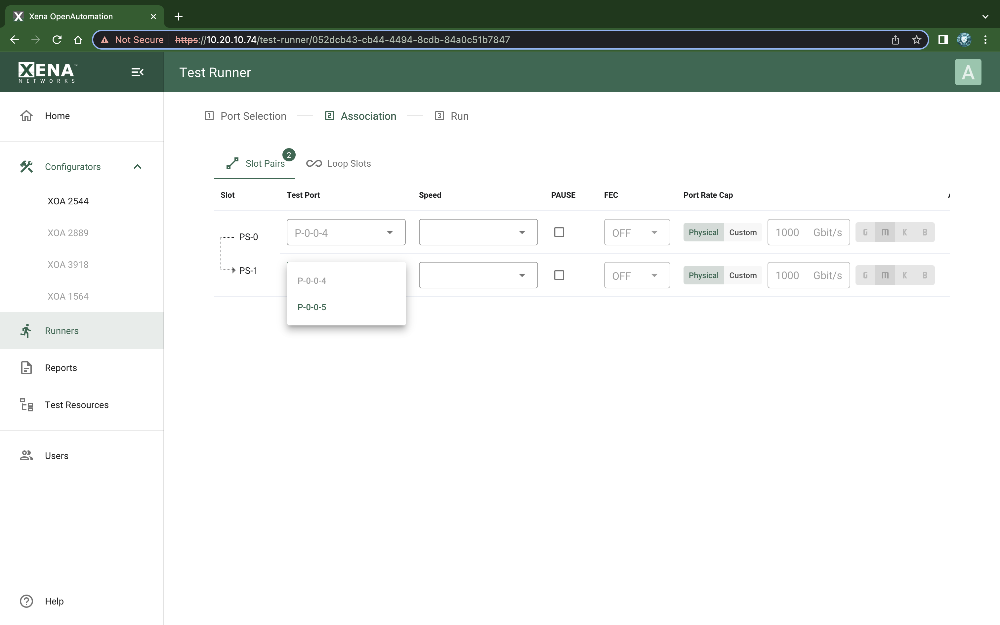

Port Association Panel
=======================

.. _association:

    XOA Test Runner - Association

This panel allow you to control which physical ports to assign to the slots in the test configuration to run a test, and also to configure the port properties. 

Port Association Table
-----------------------
The table contains the configurable columns and the read-only columns:

* Configurable columns are for properties dependent on the physical port's capabilities. They can differ from port to port.
* Read-only columns are for logical setup that is applicable to all port regardless of their type and model. The values come from the test configuration and are protected.

.. list-table:: Port Association Table
    :widths: auto
    :header-rows: 1
    :stub-columns: 1

    *   - Column
        - Explanation
    *   - Slot
        - The slot index and an arrow indicating the traffic direction. The number in the circle tag shows how many slots you need to associate physical ports to.
    *   - Test Port
        - The index of the physical test port.
    *   - Speed
        - The physical port speed to use in the test. Normally this should be left at the default AUTO value, but certain DUTs require that the port speed is fixed to a specific rate.
    *   - PAUSE
        - Controls whether the port responds to incoming PAUSE frames, if supported.
    *   - FEC
        - Controls the FEC mode of the port, if supported.
    *   - Port Rate Cap
        - Allow you to specify a rate cap type for the port. If enabled the port rate will be capped with the value specified.
    *   - AN
        - Controls whether auto-negotiation should be enabled on the port. This is only applicable to the CU ports, if supported.
    *   - MDI/MDIX:	
        - Enables control over the port MDI/MDIX mode, if supported.
    *   - BRR
        - Allow you to specify the BroadR-Reach mode of the port, if supported.
    *   - AN/LT
        - Controls whether AN/LT should be enabled on the port. This is only applicable to the high-speed ports, if supported.
    *   - IFG
        - Inter-Frame Gap. Specifies the minimum gap between frames generated for a port, expressed as a number of bytes.
    *   - Latency Offset
        - An optional offset in nanoseconds for the port which is used for latency measurements. You can measure an appropriate value for this by looping two testports together and performing a latency test. The resulting average latency of this test should be zero. If this is not the case you can adjust the Latency Offset value until you reach a zero value. Then you can use the calibrated value in other tests.
    *   - Speed Reduct.
        - Specifies an optional speed reduction on the transmit side of the port, expressed as a part-per-million (ppm) value.
    *   - Protocol Segment Profile
        - Read-only. The value comes from the test configuration.
    *   - IP / Prefix
        - Read-only. The value comes from the test configuration.
    *   - Gateway
        - Read-only. The value comes from the test configuration.
    *   - Public IP / Prefix
        - Read-only. The value comes from the test configuration.
