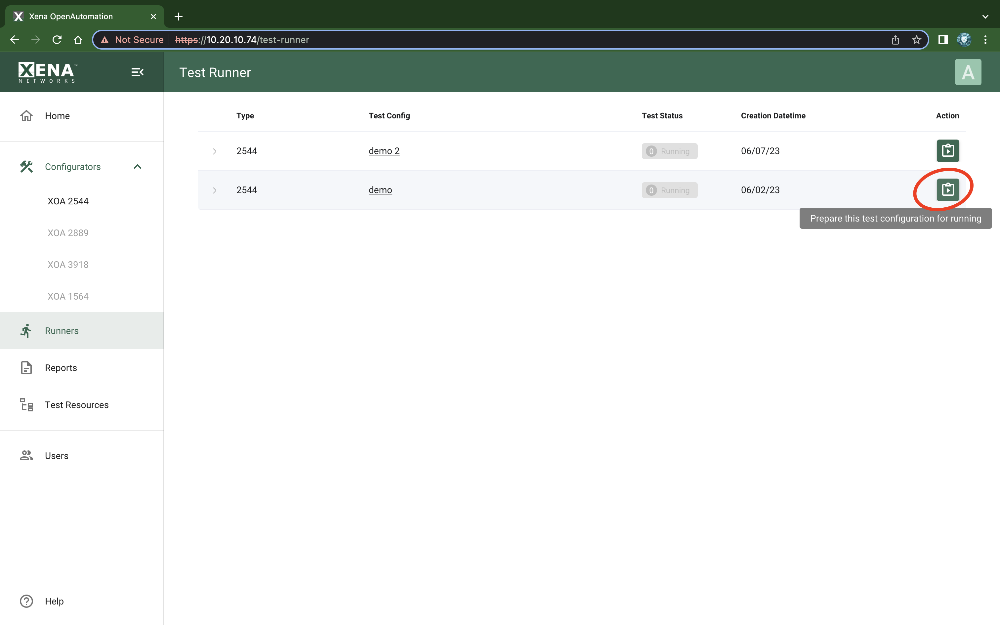
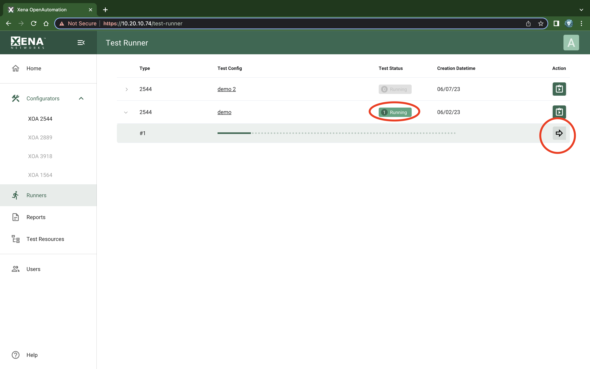

Test Runner List
=======================

:menuselection:`Runners` page lists your ready-to-run test configurations and running tests. Each row is a test configuration that you can use to execute a test. To start prepare a test with the test configuration, click :guilabel:`Prepare this test configuration for testing` button, as shown in :numref:`test_runner_list_1`.

.. _test_runner_list_1:

    XOA Test Runner List (1)

:guilabel:`Test State` shows the how many tests are running using the test configuration. Click :guilabel:`Go to test` to go to the running test result panel as shown in :numref:`test_runner_list_2`.

.. _test_runner_list_2:

    XOA Test Runner List (2)

