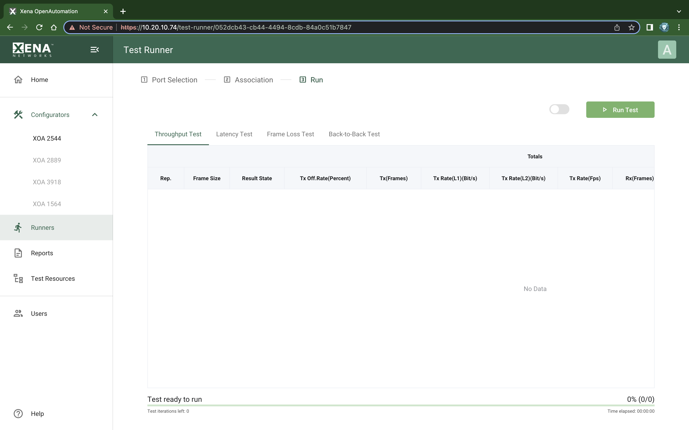
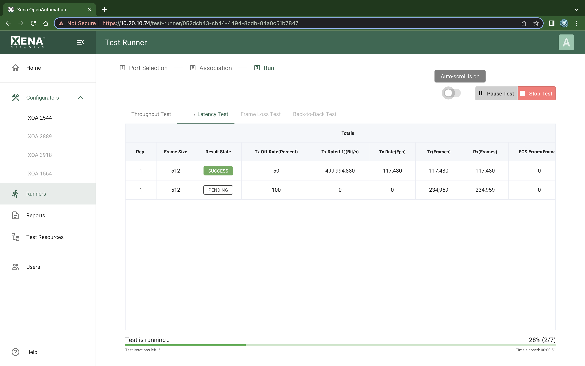

Run Test Panel
=======================

.. _run_1:

    XOA Test Runner - Run Test (1)

.. _run_2:

    XOA Test Runner - Run Test (2)

Result Data Table
------------------

The Result Data table will display both polled progress data and result data for the tests being executed in a grid view. Each result will be shown in a single line in the grid.

The polled progress data is updated periodically while the current test iteration is executing. After the test iteration has completed the result data for that trial will be calculated and shown.

The :guilabel:`Result State` column will shown the state of the current iteration run. While the test is in progress the state will always be :guilabel:`PENDING`. A trial result may be final in which case the column will show either :guilabel:`SUCCESS` or :guilabel:`FAIL`, or :guilabel:`DONE` depending on the test outcome. If the test needs to perform another iteration the state will again be :guilabel:`PENDING`.

The columns used will depend of the test being performed. Most tests will provide a set of **total values** and a set of **per-port values** but as stated this depends on the test.

Status Line
------------

The status line at the bottom provides information about the current test progress. It contains the following information:

.. list-table:: Port Association Table
    :widths: auto
    :header-rows: 1
    :stub-columns: 1

    *   - Field
        - Explanation
    *   - Progress Bar
        - Shows the progress of the overall test. The number of steps in the progress bar is the total number of iterations in the test, which is equal to the sum of repetitions multiplied with the number of frame sizes defined multiplied with the number of traffic rates to sweep.
    *   - Test State
        - A state field showing whether the **test is running** or **test ready to run**.
    *   - Time Elapsed
        - Shows the total elapsed test time, including delays between test iterations.