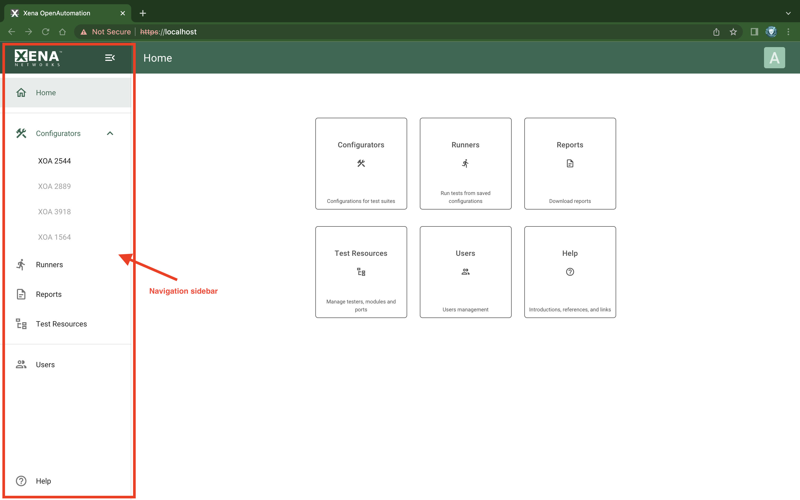

Navigation Sidebar
==================

.. _ref-sidebar:

    Navigation Sidebar

The navigation sidebar can be collapsed and expanded on all pages, providing quick access to different functionalities.

.. list-table:: Navigation Sidebar
    :widths: 30 70
    :header-rows: 1

    *   - Item
        - Explanation
    *   - Configurators
        - Lets you create test configuration, protocol segment profiles, and report configurations.  
    *   - Runners
        - Lets you create and run tests by associating test configurations and physical test ports.
    *   - Reports
        - Lets you download test reports that are generated from test results using certain report configurations.
    *   - Test Resources
        - Enables you to add/remove/manage Xena testers in your test resource inventory.
    *   - Users
        - Management of users of the application.
    *   - Help
        - Provides basic introduction information.