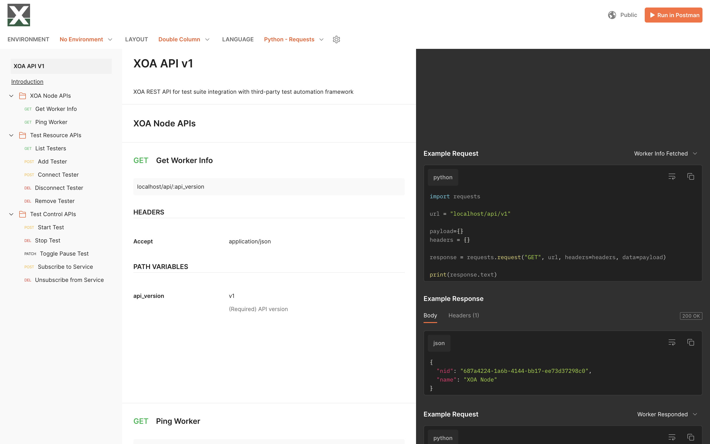

REST API
========

You can use REST API to manage test resources and test with XOA Workers.

XOA API is developed using Postman.

* `XOA API v1 Documentation: <https://documenter.getpostman.com/view/6625866/2s8ZDU5jP5>`_
* `XOA API Schema <https://github.com/xenanetworks/open-automation-rest-api/blob/main/postman/schemas/index.yaml>`_

